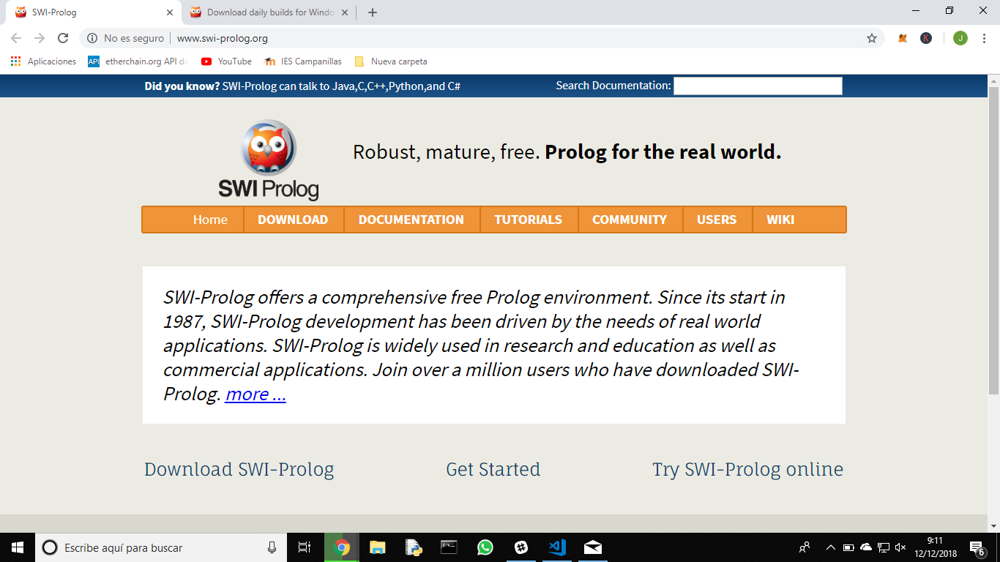
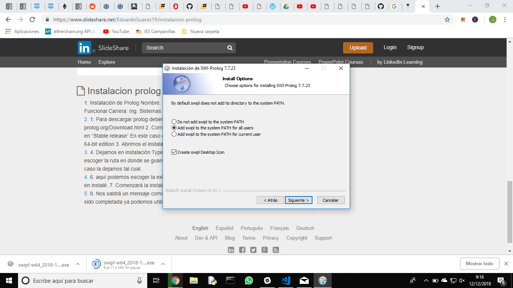
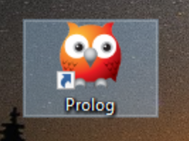
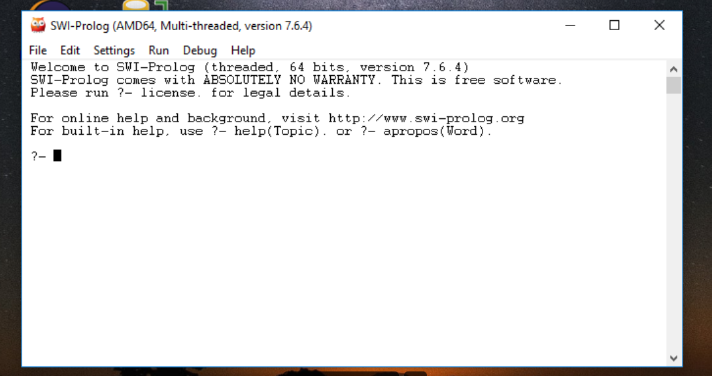
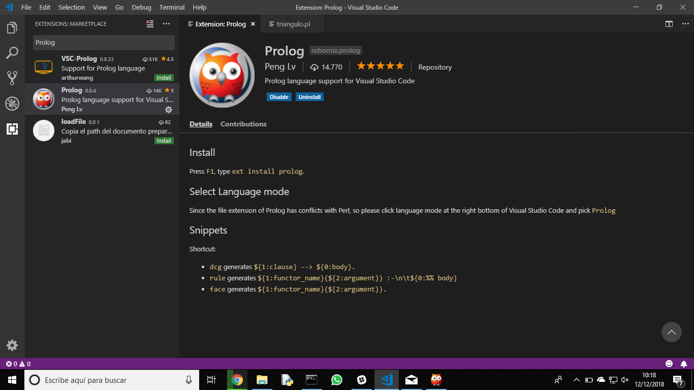
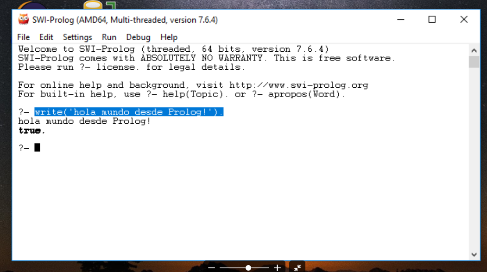
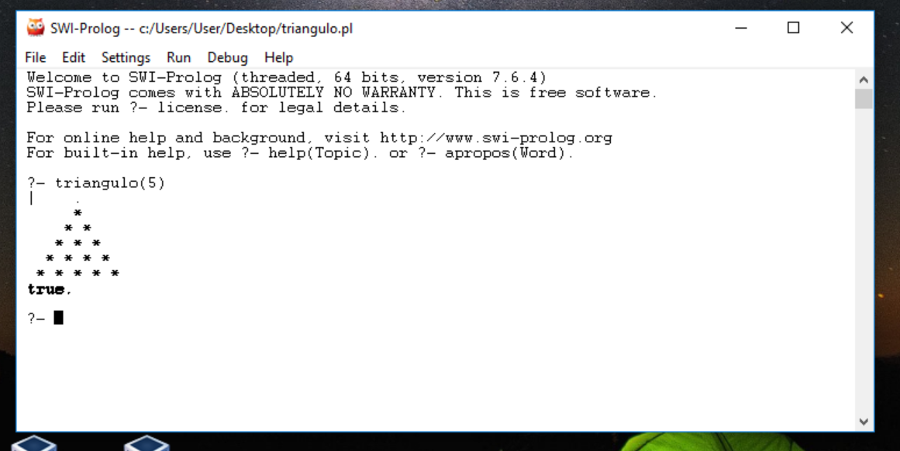

# Aprende Prolog en un día .

## Introducción

Cuando te sacaste el carnet de conducir, aprendiste las normas de circulación así como los fundamentos básicos para manejar un coche: volante, marchas, freno, acelerador, embrague, retrovisores... Seguramente, el coche que conduces ahora es diferente al que utilizaste para aprender a conducir, no obstante, lo puedes llevar sin problema. Cada coche tiene sus peculiaridades, pero quien sabe manejar un automóvil, puede adaptarse a las medidas, tacto y comportamiento de un vehículo en cuestión de horas.

Aprender a programar es como aprender a conducir. Si tienes una base sólida de programación y sabes manejar con soltura los tipos de datos, bucles, arrays, clases, métodos, etc. podrás pasar de un lenguaje a otro en un período relativamente corto, simplemente tendrás que adaptarte a la sintaxis y a las peculiaridades del nuevo lenguaje.

Con este ejercicio se pretende despertar el interés por otros lenguajes de programación distintos al que el alumno está estudiando como primer lenguaje.

Sigue los pasos que se indican a continuación.

## Creación del equipo

Este ejercicio se debe hacer en grupos de 3 alumnos. Uno de ellos será el representante del grupo.

## Forkea forkea

El representante del grupo debe hacer un *fork* de este repositorio para utilizarlo como base.

## Añadiendo colaboradores

El encargado del grupo deberá añadir como colaboradores del repositorio *forkeado* a los otros dos miembros, para trabajar todos sobre los mismos archivos. Cuando alguien es colaborador en un repositorio, puede hacer *push* a él sin necesidad de pedir permiso o hacer *pull request*.

Para añadir colaboradores hay que hacer click en la pestaña *Settings* y seleccionar luego *Collaborators* en el menú.

## Miembros del grupo

Escribe aquí los miembros del grupo. El primero es el representante o encargado.

* Iván Pérez Molina
* José Robles Bastidas
* Rubén Pacheco Matas

## Lenguaje de programación

El profesor llevará una cajita llena de papelitos con los nombres de distintos lenguajes de programación. Los encargados de cada grupo meterán la mano en la caja y sacarán dos papelitos, de los cuales el grupo elegirá uno. Se permite hacer intercambio de papelitos entre grupos.

Escribe el lenguaje de programación elegido por el grupo.

* PROLOG 

Los papelitos se han recortado de este [documento](lenguajes_de_programacion.pdf).

## Información sobre el lenguaje

Es un lenguaje de programación lógico e interpretado, bastante conocido en el medio de investigación en Inteligencia Artificial.

Se creó a principios de los 70 en Francia. Creado por unos estudiantes los cuales tenían como objetivo la clasificación algorítmica de lenguajes naturales.

Las ventajas que le encontramos a Prolog es que no hay que preocuparse por como se resuelve un problema; solo debemos definir el problema para que Prolog encuentre la solución. El reto consiste en saber definir el problema correctamente para que Prolog pueda entenderlo y nos pueda dar una solución acorde a lo que buscamos, de lo contrario, no tendremos una solución válida. 


En Wikipedia hay una definición más detallada y un montón de ejemplos en los cuales vemos que realmente es un lenguaje lógico e interpretado. Dejo por [aquí](https://es.wikipedia.org/wiki/Prolog) un enlace 


## Herramientas de desarrollo

Vamos a proceder a instalar el interprete de Prolog (ya que este lenguaje es interpretado). Para ello nos vamos a la [página de Prolog](http://www.swi-prolog.org/).



Ahora simplemente nos descargamos una versión estable y procedemos a la instación

La versión que hemos escogido es: SWI-Prolog 7.6.4 para Windows de 64 bits. Aquí dejamos un enlace para acceder a la [página](http://www.swi-prolog.org/download/stable)



Una vez termina la instalación; se nos crea un icono en el escritorio. ¡Vamos a abrirlo!



Al abrirlo; podemos ver la interfaz de la consola. Así se ve:



Utilizaremos también Visual Studio Code con un plugin que nos permita utilizar Prolog


Para insertar el plugin buscamos en Visual Studio Code el plugin que se ve en la foto y lo instalamos:




## Poniendo en práctica el lenguaje

Pon en práctica el lenguaje de programación realizando los siguientes ejercicios. Para cada uno de los ejercicios, pega el código fuente de la solución y una captura de pantalla.

### 1. ¡Hola mundo!

Realiza un programa que muestre por pantalla la frase **¡Hola mundo!**.

El código que debemos usar es el siguiente:

```mensaje :- nl,
          write('hola mundo desde Prolog'),
```

Y así es como se vería la sentencia escrita en la consola:



### 2. Pirámide

Dada una altura introducida por el usuario, realiza un programa que pinte una pirámide a base de asteriscos con la altura indicada.

```
triangulo(N):- triangulo(N,1).
triangulo(_).

triangulo(Espacios,Asteriscos):- Espacios > 0,
writeN(Espacios,' '),
writeN(Asteriscos,'* '),
nl,
Espacios1 is Espacios - 1,
Asteriscos1 is Asteriscos + 1,
triangulo(Espacios1, Asteriscos1).
writeN(0,_).
writeN(N,C):-N > 0, write(C),M is N -1, writeN(M,C).
```

Tenemos que tener en cuenta que 

Y así es como se vería la sentencia en la consola:




### 3. Arrays y números aleatorios

Realiza un programa que rellene un array (o una estructura similar) con 20 números enteros aleatorios entre 1 y 100 y que seguidamente los muestre por pantalla. A continuación, se deben pasar los números primos a las primeras posiciones del array y los no primos a las posiciones restantes. Muestra finalmente el array resultado.

## Presentación de resultados

Cada equipo explicará al resto de la clase lo aprendido durante la realización del ejercicio. Todos los miembros de cada equipo deben participar en la explicación. Se puede utilizar como material de base para la presentación el repositorio de GitHub.

## Recompensa

* Todos los alumnos que realicen correctamente la actividad tendrán 0'25 puntos extra en la nota del trimestre.

* Los miembros del equipo más votado ganarán un premio.

:star: Si te ha gustado este ejercicio, dale una estrellita al [repositorio original](https://github.com/LuisJoseSanchez/aprende-un-lenguaje-en-un-dia).

